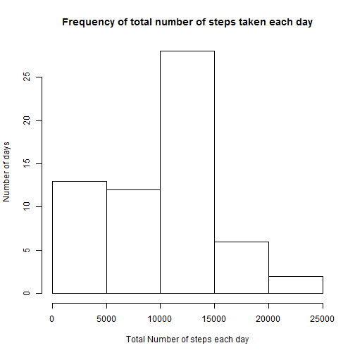
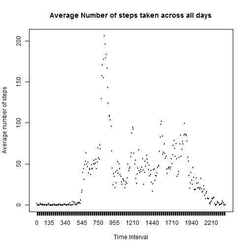
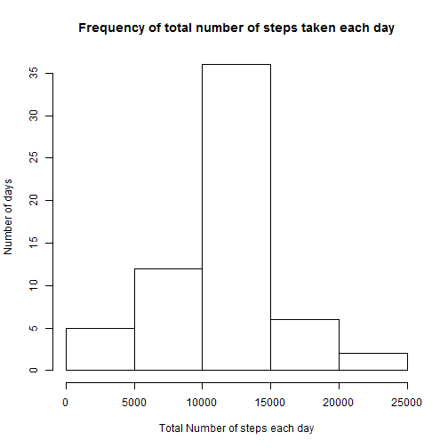
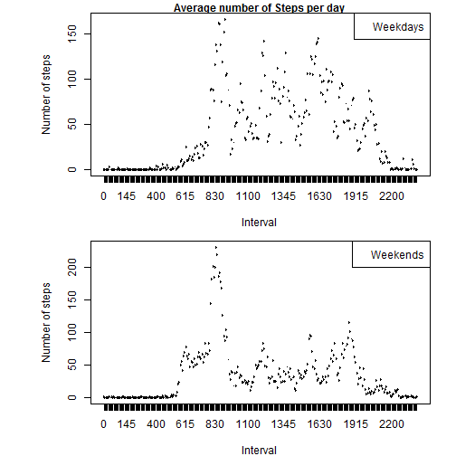

---
<<<<<<< HEAD
title: "Peer Assessment 1 - RepData"
output: html_document
---

Loading and reading data:

```r
setwd("C:/Users/om/Desktop/Coursera/RepData/Peer Assessment 1")
act <- read.csv("activity.csv")
```

###Total number of steps taken per day

```r
totalsteps <- tapply(act$steps, act$date, sum, na.rm = TRUE)
totalsteps
```

```
## 2012-10-01 2012-10-02 2012-10-03 2012-10-04 2012-10-05 2012-10-06 
##          0        126      11352      12116      13294      15420 
## 2012-10-07 2012-10-08 2012-10-09 2012-10-10 2012-10-11 2012-10-12 
##      11015          0      12811       9900      10304      17382 
## 2012-10-13 2012-10-14 2012-10-15 2012-10-16 2012-10-17 2012-10-18 
##      12426      15098      10139      15084      13452      10056 
## 2012-10-19 2012-10-20 2012-10-21 2012-10-22 2012-10-23 2012-10-24 
##      11829      10395       8821      13460       8918       8355 
## 2012-10-25 2012-10-26 2012-10-27 2012-10-28 2012-10-29 2012-10-30 
##       2492       6778      10119      11458       5018       9819 
## 2012-10-31 2012-11-01 2012-11-02 2012-11-03 2012-11-04 2012-11-05 
##      15414          0      10600      10571          0      10439 
## 2012-11-06 2012-11-07 2012-11-08 2012-11-09 2012-11-10 2012-11-11 
##       8334      12883       3219          0          0      12608 
## 2012-11-12 2012-11-13 2012-11-14 2012-11-15 2012-11-16 2012-11-17 
##      10765       7336          0         41       5441      14339 
## 2012-11-18 2012-11-19 2012-11-20 2012-11-21 2012-11-22 2012-11-23 
##      15110       8841       4472      12787      20427      21194 
## 2012-11-24 2012-11-25 2012-11-26 2012-11-27 2012-11-28 2012-11-29 
##      14478      11834      11162      13646      10183       7047 
## 2012-11-30 
##          0
```

Representing the frequency of total steps in a day:

```r
hist(totalsteps, main = "Frequency of total number of steps taken each day", xlab = "Total Number of steps each day", ylab = "Number of days")
```

 

Mean of total steps taken per day:

```r
mean(totalsteps, na.rm = TRUE)
```

```
## [1] 9354.23
```

Median of total steps taken per day:

```r
median(totalsteps, na.rm = TRUE)
```

```
## [1] 10395
```

###Average daily activity pattern

```r
act <- data.frame(act$steps, act$date, as.factor(act$interval))
colnames(act) <- c("steps", "date", "interval")
steps_interval <- tapply(act$steps, act$interval, mean, na.rm = TRUE)
plot(act$interval[1:288], steps_interval, type = "l", main = "Average Number of steps taken across all days", xlab = "Time Interval", ylab = "Average number of steps")
```

 

Time interval in which maximum number of steps were taken:

```r
act$interval[which(steps_interval == max(steps_interval))]
```

```
## [1] 835
## 288 Levels: 0 5 10 15 20 25 30 35 40 45 50 55 100 105 110 115 120 ... 2355
```

###Imputing missing values
Total number of missing values in the dataset:

```r
nrow(act[!complete.cases(act),])
```

```
## [1] 2304
```

Creating new dataset with missing values. The values are inserted by taking an average of all the days for a particular interval. Hence, if the values of lets say interval '5' is not available for a given day then it is replaced by the average steps of all the days for interval '5'.

```r
steps_interval <- rep_len(steps_interval, length.out = nrow(act))
act2 <- act
for(i in 1:nrow(act2)){
  if(is.na(act2$steps[i])){
    act2$steps[i] = steps_interval[i]
  }
}
head(act2)
```

```
##       steps       date interval
## 1 1.7169811 2012-10-01        0
## 2 0.3396226 2012-10-01        5
## 3 0.1320755 2012-10-01       10
## 4 0.1509434 2012-10-01       15
## 5 0.0754717 2012-10-01       20
## 6 2.0943396 2012-10-01       25
```

Representing the frequency of total steps in a day for the new dataset:

```r
totalsteps2 <- tapply(act2$steps, act2$date, sum, na.rm = TRUE)
hist(totalsteps2, main = "Frequency of total number of steps taken each day", xlab = "Total Number of steps each day", ylab = "Number of days")
```

 

Mean of total steps taken per day:

```r
mean(totalsteps2, na.rm = TRUE)
```

```
## [1] 10766.19
```

Median of total steps taken per day:

```r
median(totalsteps2, na.rm = TRUE)
```

```
## [1] 10766.19
```
After imputing the missing values in the dataset the mean and median of the data has increased. This would have been because the overall entered values were greater than the previous mean.

###Activity patterns between weekdays and weekends
Creating a new variable with two levels - 'weekdays' and 'weekends'

```r
library(lubridate)
act2$day <- factor(wday(act2$date) > 1 & wday(act2$date) < 7)
levels(act2$day)[levels(act2$day) == "TRUE"] <- "weekday"
levels(act2$day)[levels(act2$day) == "FALSE"] <- "weekend"
head(act2)
```

```
##       steps       date interval     day
## 1 1.7169811 2012-10-01        0 weekday
## 2 0.3396226 2012-10-01        5 weekday
## 3 0.1320755 2012-10-01       10 weekday
## 4 0.1509434 2012-10-01       15 weekday
## 5 0.0754717 2012-10-01       20 weekday
## 6 2.0943396 2012-10-01       25 weekday
```

Average steps trend during weekdays and weekends:

```r
steps_intervalnew <- tapply(act2$steps, list(act2$interval, act2$day), mean, na.rm = TRUE)
par(mfcol = c(2,1), mar = c(4,7,1,2))
plot(act2$interval[1:288], steps_intervalnew[,1], type = "l", xlab = "Interval", ylab = "Number of steps")
legend("topright", "Weekdays")
title(main = "Average number of Steps per day", cex.main = 1)
plot(act2$interval[1:288], steps_intervalnew[,2], type = "l", xlab = "Interval", ylab = "Number of steps")
legend("topright", "Weekends")
```

 
